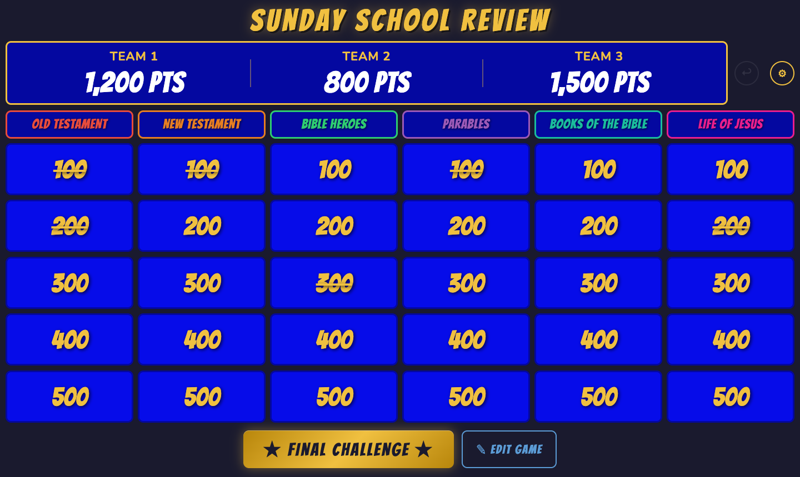

# Sunday School Review

A Jeopardy-style quiz game built for classroom use with USB buzzer dongles. Runs entirely in the browser — no install, no server required.



## Running the game

Just open `index.html` in Chrome. That's it.

> If you want to serve it over a local network (e.g. to a TV via AirPlay), run:
> ```
> python3 -m http.server 3456
> ```
> Then open `http://localhost:3456` on any device on the same network.

## Loading a game

The game ships with built-in Sunday School questions. To use your own:

1. Click the **⚙ gear** icon → **Load YAML File** and pick a `.yaml` file.
2. Or use the **✏ Edit Game** button to edit the current game directly in the browser.

To make a game auto-load every time you open the app:

1. Load or edit your game until it looks right.
2. Click **✏ Edit Game** → **📌 Save as Default**.

The game is now saved to your browser's local storage and will load automatically on every launch.

## Editing a game

Click **✏ Edit Game** from the main board. You can:

- Change the game title and team names
- Edit any clue's point value, answer text, and correct response
- Check **Verse** to mark a clue as a Bible verse lookup (shows a 📖 icon during play)
- Edit the Final Challenge question
- **⬇ Download YAML** to save the game as a file you can share or edit in a text editor
- **📌 Save as Default** to make this game auto-load next time

YAML files can also be edited by hand. The format is straightforward:

```yaml
title: "My Game"
teams:
  - "Team 1"
  - "Team 2"
  - "Team 3"
categories:
  - name: "Category Name"
    clues:
      - points: 100
        answer: "The clue shown to players"
        question: "What is the answer?"
        verse_lookup: true   # optional — shows book icon
      - points: 200
        answer: "Another clue"
        question: "Who is someone?"
final_challenge:
  category: "Final Challenge"
  answer: "The final clue"
  question: "What is the answer?"
```

## Playing

### Keyboard shortcuts

| Key | Action |
|-----|--------|
| `Space` | Open / close buzzers |
| `1` / `2` / `3` | Buzz in for Team 1 / 2 / 3 |
| `Esc` | Return to board (confirms if a clue is open) |

### Flow for each clue

1. Click a point value on the board to open the clue.
2. Press **Space** (or click **Open Buzzers**) when ready for teams to buzz in.
3. Teams press their buzzer key (1, 2, or 3). A colored flash and sound confirms the buzz.
4. Click **✓ Correct** or **✗ Wrong**. Wrong advances to the next team in buzz order.
5. Click **Show Answer** to reveal the correct response.

### Bible verse lookup clues

When a clue has the 📖 icon, students race to look up the referenced verse. Use the **Verse Found** buttons in the footer to award points to any team that finds it — multiple teams can earn points.

### Final Challenge

Click **★ Final Challenge ★** at any time to show the high-stakes final question. After awarding or not, the game over screen appears with the winner and final scores.

### Fixing mistakes

- **Undo (↩)** — appears next to the scoreboard after any score change; click to reverse the last action.
- **Click any score** on the board to edit it directly and type the correct value.

## Settings

Click **⚙** to configure:

- **Team names and colors** — colors match your physical buzzer colors (default: red, yellow, green)
- **Buzz weights** — give a team a slight advantage in tie-breaking if their buzzer is slower
- **Randomization window** — how long after the first buzz other simultaneous presses are accepted
- **Display delay** — dramatic pause before showing who buzzed in
- **Timer duration** — default 15 seconds
- **Verse lookup points** — default 1,000
- **Final Challenge points** — default 5,000
